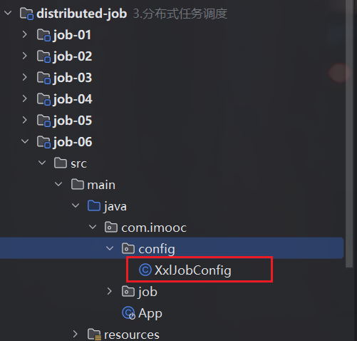
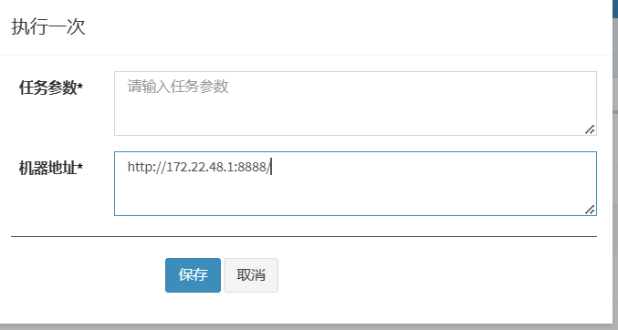
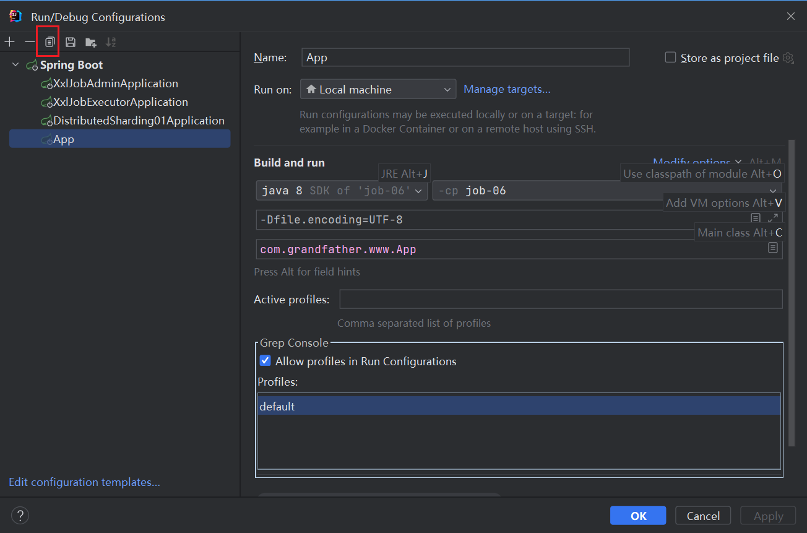
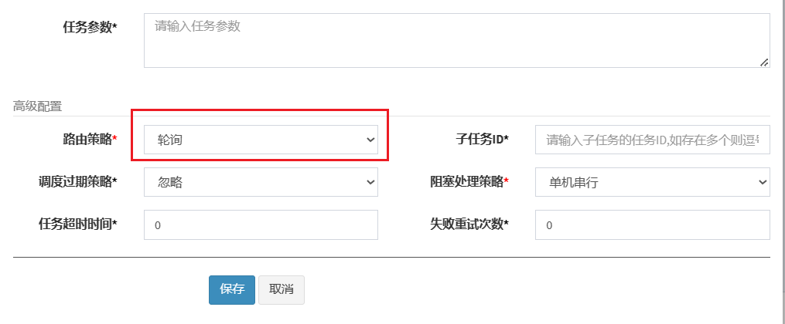

[TOC]

# 任务调度

## 任务调度适用场景

| 序号 | 名称   | 描述                                                               |
|----|------|------------------------------------------------------------------|
| 1  | 报表   | 电商项目使用:<br>昨天订单量,  上个月的订单,<br>每个店长昨日,每周每月的销售量<br>需要每天或者每月定时去计算生成 |
| 2  | 日月结单 | 一般是支付,金融领域(证券公司)                                                 |
| 3  | 爬虫   | 每天或者每几小时,定时的爬取别人的内容                                              |
| 4  | 数据归档 | 数据到了一定的量级,可以对其进行归档,作为冷数据<br>比如订单量                                |

* 1.2.3是基于时间,4是基于数据.

## 任务调度框架

| 序号 | 名称   | 描述                                                                                                                 |
|----|------|--------------------------------------------------------------------------------------------------------------------|
| 1  | 非分布式 | 想要获取商家上个月订单,但是,代码在两个tomcat上,非分布式两个服务器都启动,都来运行这个任务, 而想要的结果实际只在一台服务器上,适合分布式框架,但是非分布式的框架用起来简单,既不需要高并发,也不需要高可用,挂掉一回无所谓 |
| 2  | 分布式  |                                                                                                                    |

### 非分布式调度框架

* @Scheduled spring框架自带

### 分布式调度框架

 序号 | 名称          | 网址                                                                                                                                                                                                           | 描述                                                              |
|----|-------------|--------------------------------------------------------------------------------------------------------------------------------------------------------------------------------------------------------------|-----------------------------------------------------------------|
| 1  | QuartZ      | [http://www.quartz-scheduler.org/](http://www.quartz-scheduler.org/)<br>[https://github.com/quartz-scheduler/quartz](https://github.com/quartz-scheduler/quartz)                                             | 原始的框架,后期很多框架基于它,缺点缺少界面化,接口不够人性化                                 |
| 2  | Elasticjob  | [https://shardingsphere.apache.org/elasticjob/](https://shardingsphere.apache.org/elasticjob/)<br>[https://github.com/apache/shardingsphere-elasticjob](https://github.com/apache/shardingsphere-elasticjob) | 旧版叫做sharedingJDBC.基于QuartZ开发,当当开源出来的框架,归属到了Apache,用了很多中间件,复杂度较高 |
| 3  | XXL-JOB(推荐) | [https://www.xuxueli.com/xxl-job/](https://www.xuxueli.com/xxl-job/) <br> [https://github.com/xuxueli/xxl-job](https://github.com/xuxueli/xxl-job)                                                           | 轻量级框架,大众点评开源出来的,适合绝大多数开发者,维护文档较好                                |
| 4  | SchedulerX  | [https://www.aliyun.com/search?k=schedulerx&__is_mobile__=false&__is_spider__=false&__is_grey__=false](https://www.aliyun.com/search?k=schedulerx&__is_mobile__=false&__is_spider__=false&__is_grey__=false) | 阿里云开发出来的商用产品,对其调度,控制台都在阿里云上,需要话费金钱,非免费                          |
| 5  | PowerJob    | [https://github.com/PowerJob/PowerJob](https://github.com/PowerJob/PowerJob)                                                                                                                                 | 比较新,阿里云schedulerx团队离职的开发写的                                      |

### Scheduled核心配置属性

| 序号 | 名称                | 描述                                                                                                                                                                                                                                                       |
|----|-------------------|----------------------------------------------------------------------------------------------------------------------------------------------------------------------------------------------------------------------------------------------------------|
| 1  | @EnableScheduling | 是否开启 schedule ,加在类上,作用就是当前类<br>加在@SpringBootApplication 上,就是整个项目生效                                                                                                                                                                                       |
| 2  | @Scheduled        | fixedDelay 默认是int型<br>fixedDelayString 说明等号后要是字符型数据<br>默认项目启动就打印 initialDelay 不在启动的时候打印 -----延迟启动<br>initialDelay 延迟启动<br>fixedDelay 固定延迟，时间间隔是前次任务的结束到下次任务的开始<br>fixedRate 时间间隔是前次任务和下次任务的开始<br>crontab  https://cron.qqe2.com/ 这个网址可以解析表达式,输入条件自动生成表达式 |

## XXL-JOB

* XXL-JOB是大众点评员工徐雪里于2015年发布的分布式任务调度平台


* 官网地址: [https://www.xuxueli.com/xxl-job/](https://www.xuxueli.com/xxl-job/)

### 一、简单配置admin

#### 环境搭建

* 使用git命令将其下载或导入到项目中.

```
  git clone https://gitee.com/xuxueli0323/xxl-job

```

##### 1.创建本地数据库

* 在整个项目的这个路径下:doc/db/tables_xxl_job.sql

##### 2.修改本地配置文件

* 找到目录distributed-job/xxl-job-master/xxl-job-admin/src/main/resources/application.properties

**配置的属性**

* application.properties

| 序号 | 名称                                  | 描述                |
|----|-------------------------------------|-------------------|
| 1  | spring.datasource.url               | 数据库连接配置           |
| 2  | spring.datasource.username          | 数据库账户配置           |
| 3  | spring.datasource.password          | 数据库密码配置           |
| 4  | spring.datasource.driver-class-name | 默认是MySQL8,不是的需要修改 |

* logback.xml配置

| 序号 | 名称                                                                           | 描述                        |
|----|------------------------------------------------------------------------------|---------------------------|
| 1  | <property name="log.path" value="./data/applogs/xxl-job/xxl-job-admin.log"/> | value前边加个点,或者自定义本地路径,否则报错 |

##### 3.Maven打包

* mvn clean install

##### 4.启动服务

* 找到xxl-job-admin模块下的XxlJobAdminApplication.java,右键run执行.

##### 5.界面访问

* 访问地址: [http://localhost:8080/xxl-job-admin/](http://localhost:8080/xxl-job-admin/)

* 默认账户/密码 : admin/123456

### 二、自研开发的项目配置到admin

* 主要分两部分，一个是config的配置，一个是自研的项目，在admin中有个实例

| 序号 | 名称                                                          | 描述                            |
|----|-------------------------------------------------------------|-------------------------------|
| 1  | xxl-job-executor-samples/xxl-job-executor-sample-springboot | 找到这个模块，关于springboot的配置可以仿造这个写 |

#### 1.拷贝配置类


* XxlJobConfig.java到自己的项目中，修改其包名



#### 2.修改本地项目的配置文件

* application.yml

| 序号 | 名称                                          | 描述                                               |
|----|---------------------------------------------|--------------------------------------------------|
| 1  | xxl.job.admin.addresses                     | 配置admin的连接一般是http://127.0.0.1:8080/xxl-job-admin |
| 2  | xxl.job.accessToken（必须有，不然报错）               | 目前的是必须配置：default_token这个值                        |
| 3  | xxl.job.executor.appname                    | 当前应用的名称，自己起一个跟默认的名字不重复就行                         |
| 4  | xxl.job.executor.address（必须有，不然报错）          | 这个是注册地址，不填写会自动生成，根据填写的ip和port生成，但是这个字段要有         |
| 5  | xxl.job.executor.ip（必须有，不然报错）               | 上面的注册中心的IP地址，默认不填会跟服务器保持一致                       |
| 6  | xxl.job.executor.port（必须有，不然报错）             | 自定义一个没有被占用的端口就可以，不填会分配9999，但是会与默认的项目中的ip冲突，还是设置下 |
| 7  | xxl.job.executor.logretentiondays（必须有，不然报错） | 日志过期时间，要填写写个7天还是一个月都可以                           |
| 8  | xxl.job.executor.logpath                    | 日志存储路径，如果有了logback.xml会以那个的配置为主                  |

**官方文档**


#### 3.自定义的执行管理器

* 正常创建一个类，但是必须要有这两个注解

| 序号 | 名称                         | 描述                   |
|----|----------------------------|----------------------|
| 1  | @Component                 | 可以被扫描到spring的bean启动中 |
| 2  | @XxlJob("myXxlJobHandler") | 加入到xxl-job的必填注解      |

#### 4.启动自定义的服务

* 日志会有注册到xxl-job中去的字样

```

12:08:19.568 logback [main] INFO  com.imooc.config.XxlJobConfig - >>>>>>>>>>> xxl-job config init.
12:08:19.671 logback [main] INFO  o.s.s.c.ThreadPoolTaskExecutor - Initializing ExecutorService 'applicationTaskExecutor'
12:08:19.807 logback [main] INFO  c.x.job.core.executor.XxlJobExecutor - >>>>>>>>>>> xxl-job register jobhandler success, name:myXxlJobShardingVo, jobHandler:com.xxl.job.core.handler.impl.MethodJobHandler@2b8bd14b[class com.imooc.job.MyXxlJob#shardingVo]
12:08:19.808 logback [main] INFO  c.x.job.core.executor.XxlJobExecutor - >>>>>>>>>>> xxl-job register jobhandler success, name:myXxlJobHandler, jobHandler:com.xxl.job.core.handler.impl.MethodJobHandler@50d3bf39[class com.imooc.job.MyXxlJob#execute]


```

#### 5.界面配置

* 首先要配置的就是执行管理器，点击新增。(此版本只能手动添加)


* 按照图片的介绍填写下，重点是JobHandler这个要与自定义个名字一致。


* 配置成功后会出现在列表中，添加对了会产生一个机器地址，如图，点击查看


* 这个ip地址需要关联到任务管理的任务中，所以，点击查看，复制到一个文件中。


* 配置任务管理，点击新增一个管理的任务。


* 填写配置的信息


* 配置成功后会出现在列表中，点击操作这里，如果测试可以选择执行一次，如果要一直执行，选择启动。


* 例如：选择执行一次的时候，会弹出填写机器码，刚刚备份的机器码粘贴在这里，选择保存。




* 执行成功界面显示。


* 在自定义的springboot项目的日志中就可以看到执行的情况。


* 界面管理系统就是查看调度日志,然后点击操作,找到执行日志,就可以看到.


#### 6.路由和阻塞策略

* 图中两个的配置


**路由策略**

* 本质就是一个负载均衡.

##### springboot开启负载两个服务

* 测试方式就是启动两个springboot,在vm里设置-Dserver=8086,需要换个端口.





* 注意不要在config中定义port,这样负载启动就不会端口冲突,xxl-job会自动为开发者配置,写死了,就不会给开发者配置了.


* 启动两个项目后,管理不改变,只会在一个服务中运行.


* 改为轮询就会两个服务都被执行到.



**官方文档**


* 推荐使用: FAILOVER（故障转移）：按照顺序依次进行心跳检测，第一个心跳检测成功的机器选定为目标执行器并发起调度；

* 选择这种模式后,有机器挂机了,会自动切换到好使的服务上去.

* 一台服务器选择故障转移,多台选择轮询,轮询内包含了故障转移.

**分片模式**

* 配置后执行


#### 阻塞策略

| 序号 | 名称     | 描述                                           |
|----|--------|----------------------------------------------|
| 1  | 单行串行   | 一个任务接着一个任务执行                                 |
| 2  | 丢弃后续调度 | 一个任务来查看资源是否空缺,空缺就执行,不空缺就去等待,过一会再来查看是否有资源可以执行 |
| 3  | 覆盖之前调用 | 一个任务在执行,新来的资源直接终止当前任务,然后自己执行                 |


**单行串行**

* 关了调度也会运行,因为之前排了队,会把队伍执行完毕.


**丢弃后续调度**

* 平台打印一样,日志会有区别,会有间隔的产生失败,停止就会全部停止,最推荐使用,不要使用排队


**覆盖之前调用**

* 最不推荐使用,上一个任务还未成功,下一个任务来了就执行.


* 日志查看,多次抛异常


