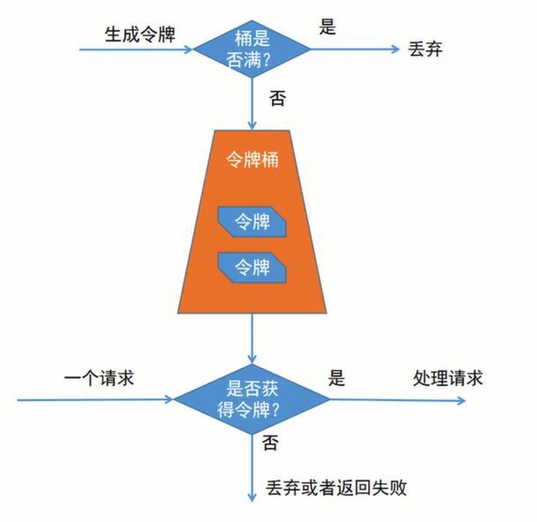

# 限流

* 流量很大,流量过大就会产生阻塞和崩溃,本质就是超出了负载.

**限流**

* 控制流量,达到保护的目的.
* 负载不够用了,才会有限流的存在.
* 处理方式:要么挡住过载的流量,要么排队增加处理时长.

## ab限流工具使用

[相关文章](../doc/ApacheBench的安装.md)

## 常见限流工具

### 漏桶算法

* 怎么让水的流速保持一致呢?让其匀速流动.用这个孔就可以控制流速.

### 令牌桶算法

*

程序会以固定的速率生成令牌,把令牌丢到令牌桶当中去,用户的请求被接收到后,先从令牌桶中获取令牌,如果能拿到令牌,就继续后续请求,如果拿不到令牌,就返回失败(
算法类似于去医院挂号),生成令牌的速度是由程序来控制的,可以一秒钟生成五个,也可以生成十个,

* 用户取令牌的速度也是可以控制的,可以让其一次拿五个,也可以让其一次拿十个
  

### 两种算法比较

| 选项   | 漏桶算法                                                                         | 令牌桶算法                                                                 |
|------|------------------------------------------------------------------------------|-----------------------------------------------------------------------|
| 特点   | 结果: 控制水流的速度,以固定的速度流出 更多的是保护其他系统                                        | 更多的是保护系统本身                                                            |
| 应用场景 | 如果短时间内突然数据量暴增,如果不限流,第三方的系统就会直接崩溃 这时候使用漏桶算法,保证本系统流出的流量是平稳的,匀速的,这样就保护了第三方系统 | 秒杀,抢购,这样一瞬间来了一大波流量 令牌桶算就很合适,不管来多少,首先要那到令牌,有令牌的就可以进行接下来操作,没有流派就返回失败 |

#### 单机版算法 ---------- Guava RateLimiter

* 应用的是令牌桶算法 ---开发主要是limiter-01模块

#### 分布式限流 ---------- Sentinel

| 序号 | 名称               | 描述                                                                                                                   |
|----|------------------|----------------------------------------------------------------------------------------------------------------------|
| 1  | 阿里巴巴的Sentinel    | [官网](https://sentinelguard.io/zh-cn/)  [https://github.com/alibaba/Sentinel](https://github.com/alibaba/Sentinel) |
| 2  | 阿里巴巴的sprinbcloud | [https://github.com/alibaba/spring-cloud-alibaba](https://github.com/alibaba/spring-cloud-alibaba)                   |

* 网关限流,接口限流,

### git的wiki阅读

## 客户端查看

* 修改流控

* QPS(每秒查询速率) 设置为1

* 再看实时监控,就有数据了.(点的多数据就更明显)

[2023的链接地址](https://github.com/alibaba/spring-cloud-alibaba/blob/2022.x/spring-cloud-alibaba-examples/sentinel-example/sentinel-core-example/readme-zh.md)

* 官方文档位置.
  

**埋点**

* 对某个类方法内的某个方法进行限制,简称埋点,详见limiter-05

**规则持久化**

[处理方案](https://github.com/alibaba/Sentinel/wiki/%E5%9C%A8%E7%94%9F%E4%BA%A7%E7%8E%AF%E5%A2%83%E4%B8%AD%E4%BD%BF%E7%94%A8-Sentinel)

