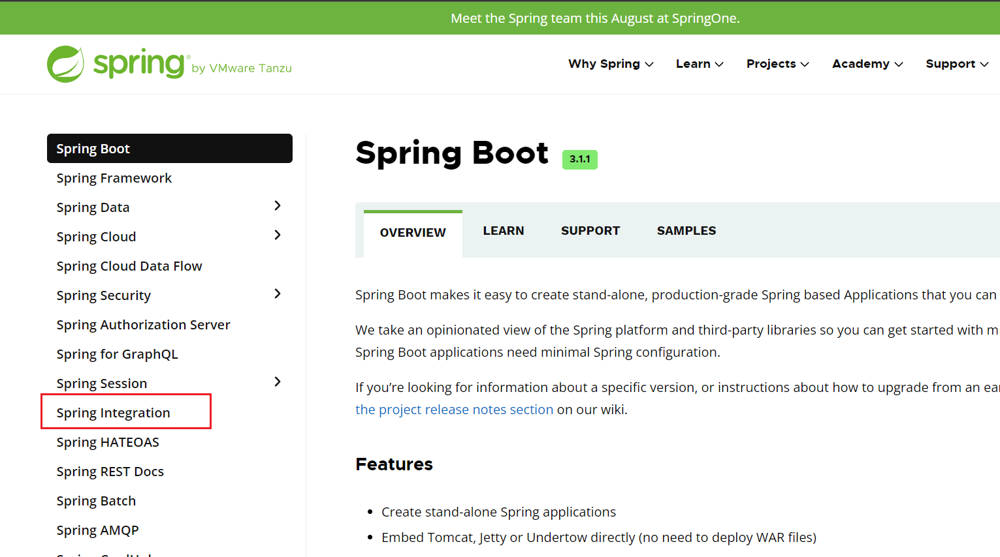
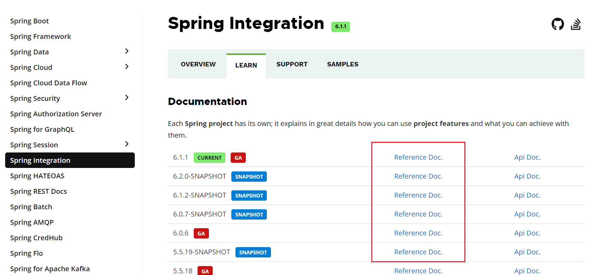
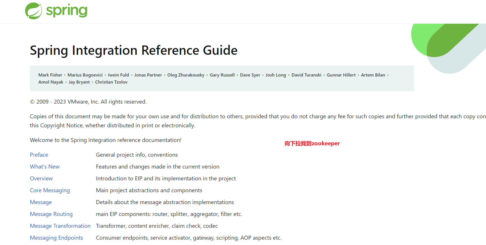
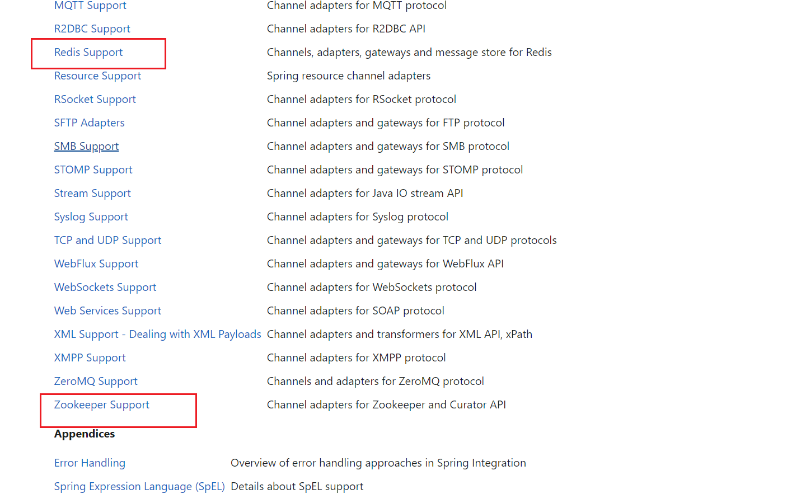
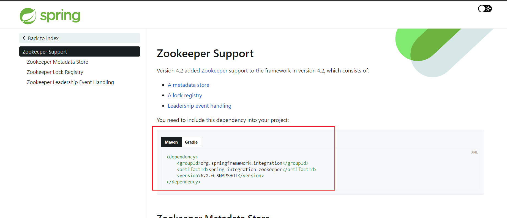
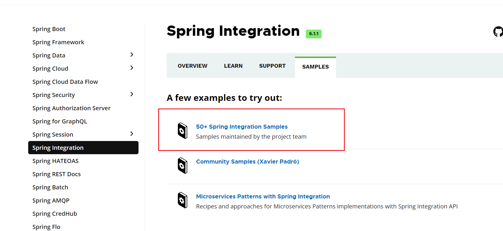
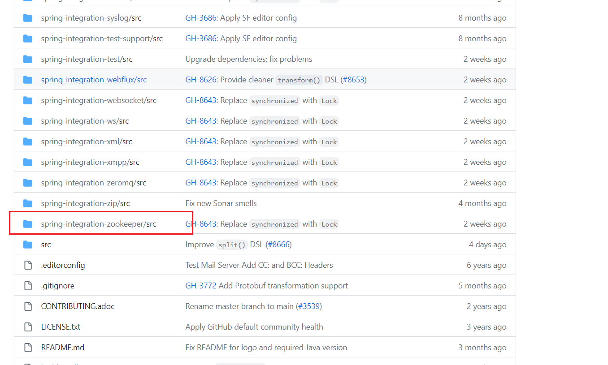
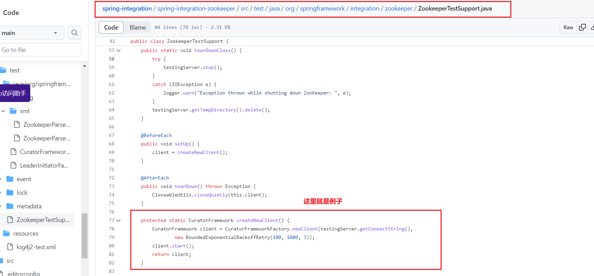

# 分布式锁

* 锁的本质,就是防止进入.

**分布式锁**

* 防止多个进程或线程之间相互干扰
* 抢购系统,没有锁,本来要卖12件,结果卖出13件.

## 常用方案

* Redis : setnx命令,原子性操作(redis自身性质,多个资源执行的时候,只能有一个在执行成功).

* Zookeeper:顺序临时节点(诞生之初,就是因为分布式锁诞生的)

* 分布式项目服务在不容机器上,所以,要把统一的锁,一起放到统一的外部上去.

### Redis实现分布式锁

* github.com/redisson/redisson 使用这个框架来实现分布式锁.


* 分布式这样配置,为了有更多服务器扩展使用

```
    spring:
        redis:
            redisson:
             file: classpath:redisson.yml

```

* 点击进入源码,可以看到相关配置的参数


* 限流是宏观的操作,锁是直接控制锁住资源.资源是自行设置的.

## 自己研究zookeeper

[Spring Integration](https://static.kancloud.cn/master-wei/springboot_master-wei/2218525)

* zookeeper分布式的速度比较慢,但是会有回调的反应.

**Spring Integration**

* 官网查找




* 找到学习的Reference Doc.







* 最后找到的位置.(这里讲的其实不多,还是看例子)



* 官网的例子



[例子位置](https://kgithub.com/spring-projects/spring-integration#samples)





