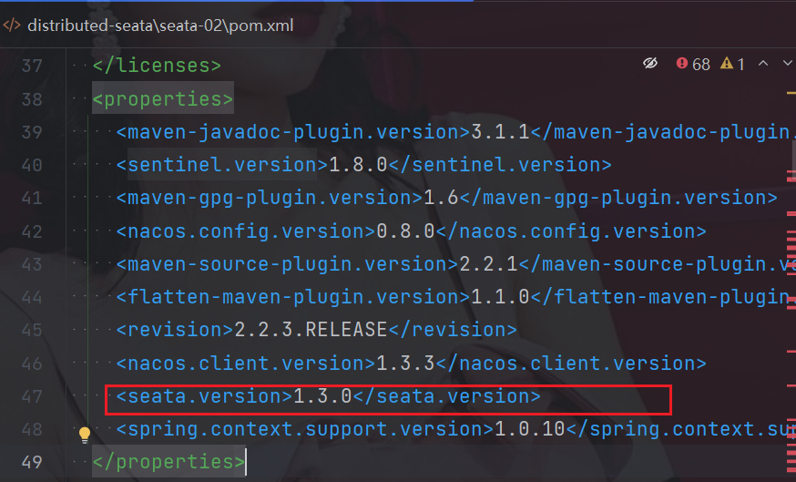

[TOC]

## 官网地址

[中文地址](https://seata.io/zh-cn/index.html)

**概念文档**

[分布式事务](./分布式事务Seata三种模式详解.html)

* 协议:就是一种想法,可以由各种语言实现.

| 序号 | 名称 | 描述                     |
|----|----|------------------------|
| 1  | TC | 事务控制器:一个独立部署的server端   |
| 2  | TM | Seata的client端:由依赖引入它   |
| 3  | RM | 应用程序中,需要做事务的一小部分的资源管理器 |

**使用AT**

* 完全不需要修改代码,无侵入式.
* @transtation是用的mysql的底层的InnerDB做的,而不是spring框架做的.

**TCC**

* 性能优于AT,但是要自行实现confirm.

**Saga**

* 高性能,高吞吐

**业务描述**

* 下单过程

* 第一步:订单系统调用商品系统接口(调用协议不限:可以是RPC,可以是Http协议),

* 第二步:商品系统操作数据库,减去库存(库存中的商品减少了一件).

* 第三步:库存系统返回成功减库存给订单系统,通知订单系统库存减少成功.

* 第四步:订单系统创建订单,将创建订单写入数据库.

**存在问题**

* 存在数据错乱:(1)第三步和第四步之间产生了异常(2)第四步创建订单失败
* 导致订单无法创建,数据库中无此订单,但是,库存被扣除了.
* 需要接口,第三步第四步产生异常,库存被扣除,但是,没有创建订单的数据不一致问题.
* 要回滚库存系统如果没有创建订单.

**目的**

* 订单创建未成功,库存系统就不能扣库存.

**Seata**

* 与springboot 的结合不看官网,直接看spring-alibaba

**查看框架内版本**

