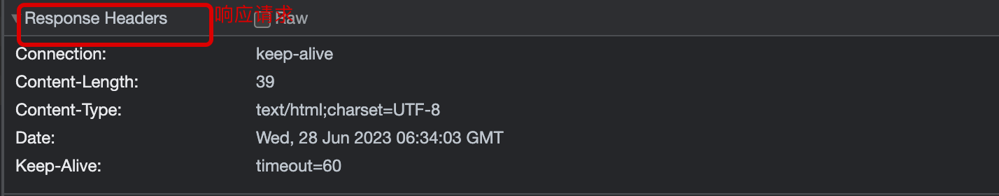
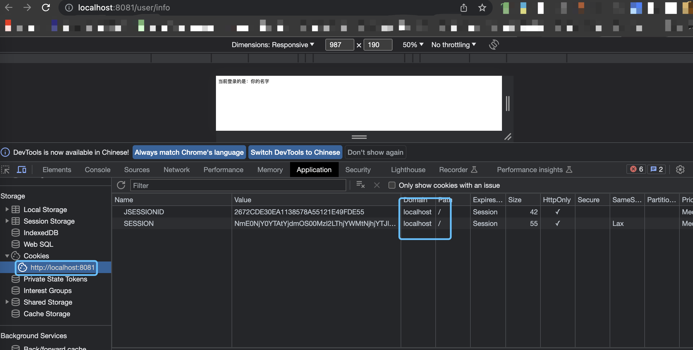

# 分布式Session

# 传统的session

## 一、工具

|序号| 名称  | 描述 |
|------|-------|------|
| 1 |  浏览器  | google/safri/火狐 |
| 2 |  IDEA  | 开发工具            |

## 二、cookie和session区别 

|序号| 名称  | 描述 |
|------|-------|------|
| 1 |  cookie  | 一般存在客户端 |
| 2 |  session  | 一般存在服务端,客户端和服务端都可以对他修改            |

## 三、基础session访问情况

### 两个接口

|序号| 名称  | 描述 |
|------|-------|------|
| 1 |  login  | http://localhost:8081/user/login?username=admin&password=123456 |
| 2 |  info  | http://localhost:8081/user/info            |

* 启动服务后,先访问login再访问info

* 如果启动后,首次先访问info,就会看不到信息,回显null

* 重启服务器,info信息消失,说明session是存在服务端的tomcat中的,而不是计算机中的.

## 四、弄清session如何保存数据,如何传递的

### 浏览器查看session

* 打开浏览器,调试到开发者模式

* 首次访问会在response中查看到set-cookie

* 查看cookie

### 开发接口,debug查看session

### 传递方式

* 分为两端一个是浏览器,一个是服务端.

* 用户通过浏览器访问接口,服务端接收请求后,账户密码正确的时候,会设置session

* 后端会生成一个set-cookie(给浏览器设置一个cookie)

* 浏览器再访问info接口的时候,浏览器就携带cookie(携带是浏览器自带特性)

* 在此请求后端,后端通过sessionid查询到session,session是一个带有很多信息的对象

* 将session对象返回给前端.

### 图解

## 五、跨域问题

* 跨域就是域名不同的时候,sessionid就会不一样

### 例子

* 访问:http://localhost:8081/user/info/ 和
http://127.0.0.1:8081/user/info/得到结果不一样.

### 查看cookie发现差异

* 127.0.0.1

* localhost

* 不是打开浏览器就能访问到session,必须是同一个域名下.

### 同一个后端服务器

* 只要把localhost的session粘贴到127.0.0.1的session上,就会访问到用户信息了.

### 不同的后端服务器

* 用idea再启动一个application.

* 得到如图的2号app,通过改变vm的配置修改端口

* 启动后,像上一个一样复制session粘贴到8082的info中结果得不到结果.

## 结论

* session是在tomcat中管理的.

#  spring session + redis 

## 一、添加pom

|序号| 名称  | 描述 |
|------|-------|------|
| 1 |  redis  | google/safri/火狐 |
| 2 |  IDEA  | 开发工具            |

## 集群环境

* 对redis相关的application.yml进行配置,而不是配置session.

