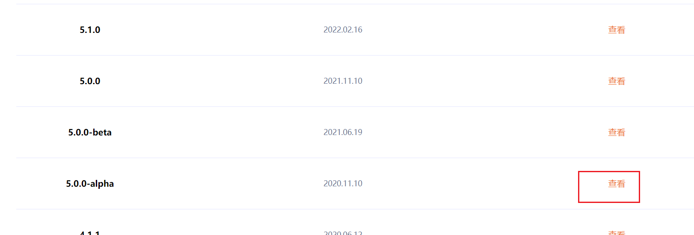
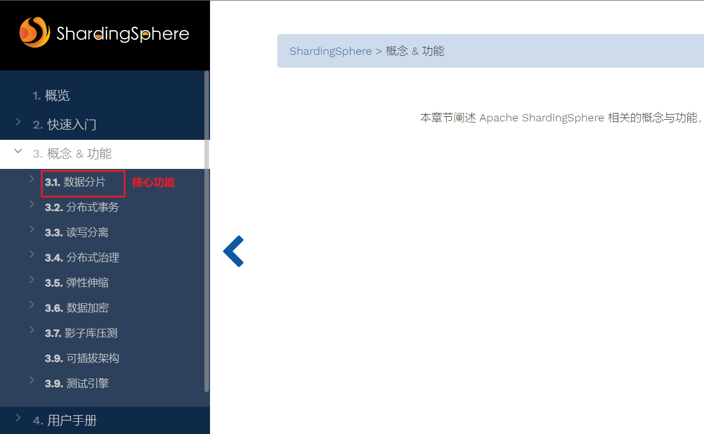
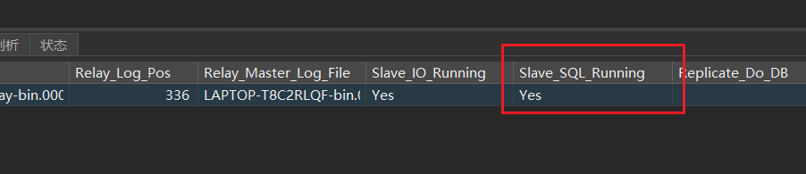
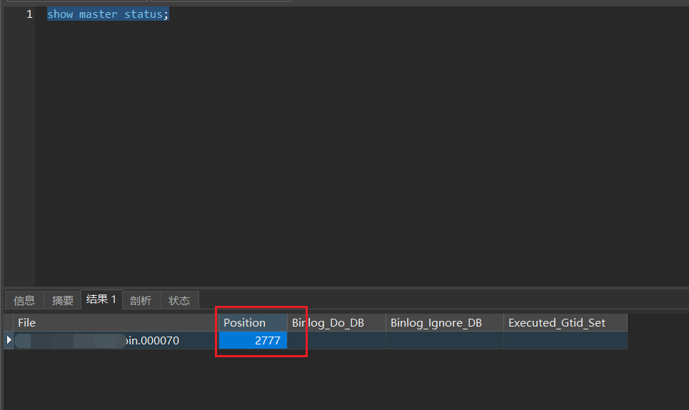
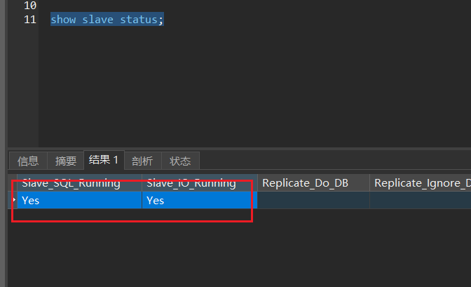

# 分库分表

## 为什么需要分库分表

* 数据库无法承载,数据库的性能瓶颈
* 数据库性能足够好,就不需要分库分表

| 序号 | 操作       | 描述                                                         |
|----|----------|------------------------------------------------------------|
| 1  | 分库       | 按照业务划分,例如:订单库和商品库(从业务方向上划分)<br> 主从数据库                      |
| 2  | 分表(比较困难) | 水平拆分,特点,每个表都一样,例如:订单表拆分<br> 垂直拆分:一个多字段的表拆分成多个表,例如订单表和订单详情表 |

**垂直拆分**

* 订单表中包含详情表,详情使用json 的格式存储在订单表的一个字段中.
* 拆分成订单表和详情表就是分表(垂直拆分)

**水平拆分**

* 订单表中字段,一分为二,生成order_01和order_02,一个表有一半的字段,字段太多可以无限拆下去.

## 两个解决方案

| 序号 | 操作                              | 描述                                     | 链接                                       |
|----|---------------------------------|----------------------------------------|------------------------------------------|
| 1  | shardingsphere(之间教shardingjdbc) | 优势不需要运维成本,直接跟java打交道(小公司,无运维人员使用)      | [官网](https://shardingsphere.apache.org/) |
| 2  | mycat                           | 需要运维,和对mycat十分了解的情况 (有运维的DBA人员的可以选择这个) | [官网](http://www.mycat.org.cn/)           |

## 文档阅读

* 首页先在右边切换语言为中文,然后找到遗留,查看到所有的历史版本.


* 找到此次版本.





**分布式治理**

* 辅助管理数据库,如果主库挂了可以自动辅助切换到从库去.

**弹性伸缩**

* 做数据迁移的.

**数据加密**

* 对个人信息进行加密,不是账号密码

**影子库**

* 压测,测试人员使用的

**可插拔架构**

* 方便扩展,为某些功能提供了扩展.

* 在数据库资源不够的时候,才会采用分库分表.

* 读写分离和主从数据库一样

* 应用程序同时连接主库和从库,如果有数据新增修改和删除操作,会对主库进行操作,新增一条数据会增加到主库中去,读取的时候会从从库当中读取.
*

主库和从库的同步数据,每次数据更改,主库都会把这些数据记录写在二进制文件当中去,从库通过IO线程,把主库的这部分日志复制到自己的日志(
中继日志)当中去,从库通过SQL线程读取中继日志,重放到自己的数据库当中去.(都是数据库自己做的事情)

## Docker容器配置文件

[OrderController.java](distributed-sharding-02%2Fsrc%2Fmain%2Fjava%2Fcom%2Fgrandfather%2Fwww%2FOrderController.java)
[OrderService.java](distributed-sharding-02%2Fsrc%2Fmain%2Fjava%2Fcom%2Fgrandfather%2Fwww%2FOrderService.java)

* 一定要在master端更新数据,slave只是查看.

## 主从配置

[本地配置windows](./windows的主从配置.html)

### 主从的坑位

* 主数据库如果在连接从数据库之前不是空的mysql,那么在主库删除一个库的时候,从库就会无法使用了.
* Slave_IO_Running会变为No



#### 解决方式

* 关闭从库(从库中运行)

```

    stop slave

```

* 修改配置参数
* 查看主库的master_log_pos属性的值,每次主库重大该改变这个值就会改变

```

   show master status;

```



* 运行修改从库的命令(在从库中)

```

   CHANGE MASTER TO master_host = '127.0.0.1',
    master_port = 3306,
    master_user = 'follow',
    master_password = 'follow',
    master_log_file = 'bin.000070',
    master_log_pos = 2777;

```

* 重启打开从库(在从库中)

```

   start slave

```

* 查看是否变为正常

```

show slave status;

```



* 难点是配置文档properties的配置,因为报错不完整,需要反复学习.


