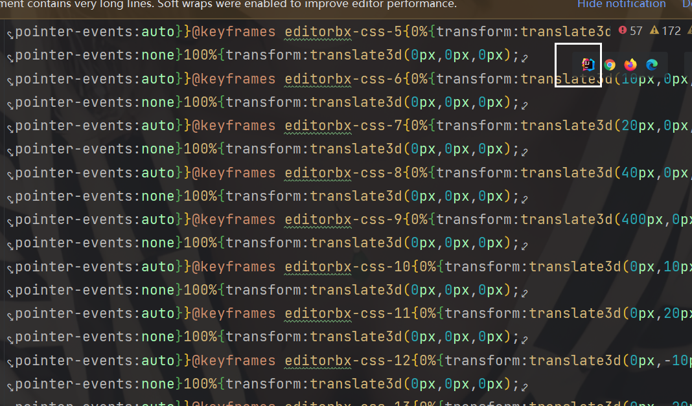

## 读写分离

* 主从数据库和读写分离是一件事
* 只有在数据库性能不够的情况下,才做读写分离
* 分库分表后,一个库作为读(查找)的数据库,一个库作为写(增删改)的数据库
* 读写分离和分库分表一起做就会超级复杂
* sharding不负责数据库数据同步,同步由mysql自己操作.
* 

### 一键安装主从数据库的插件

* [SPPPOTools-master.zip](./shell/FSPPPOTools-master.zip)
* [源地址](https://github.com/lly835/SPPPOTools)

#### 数据库使用

* 建立两个库ds0和ds1,用init.sql建立本地表
* 使用application.properties做本地测试
* 单元测试测试

### 相关文章

[mysql数据库主从配置](./mysql数据库主从配置.htm) 

[返回目录](./read.md)
